<h1 align="center">JAVA BÁSICO</h1>

<h3 align="center"> Peguei alguns conteúdos do canal do YouTube: <a href="https://www.youtube.com/watch?v=sTX0UEplF54&list=PLHz_AreHm4dkI2ZdjTwZA4mPMxWTfNSpR&index=1">Gustavo Guanabara
</a> </h3>

**(...) continua -> Curso de Java #11 - Estruturas de Repetição (Parte 1)**

> _Eu fiz com Eclipse_

- O Java começa com o código fonte, que é escrito por um programador em um arquivo com extensão .java.
- O código Java é compilado usando o compilador Java (javac). Isso cria um arquivo chamado bytecode.
- O bytecode é uma forma intermediária de código que é independente da plataforma. Ele é armazenado em um arquivo .class.
- JVM (Java Virtual Machine) é responsável por executar o bytecode em qualquer sistema operacional que tenha uma JVM instalada.
- A JVM interpreta o bytecode e executa o programa Java, produzindo resultados na tela ou realizando tarefas específicas.
- Coleta de Lixo (Garbage Collection): A JVM também gerencia a memória, incluindo a coleta de objetos não utilizados para liberar recursos.
- Bibliotecas: O Java também inclui bibliotecas (conjuntos de código pré-escrito) para ajudar os desenvolvedores a realizar tarefas comuns, como entrada/saída de dados, manipulação de strings, etc.
- Wora -> é um acrônimo para "Write Once Run Anywhere" = Escreva um vez e execute em qualquer lugar.

> 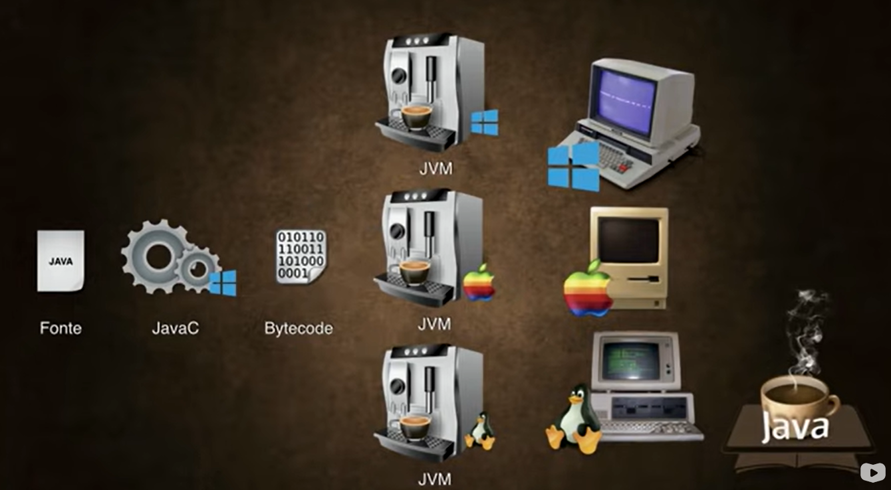 </br>

> JDK (Java Development Kit) -> Programadores Java

- Já tem JRE.
- javaLang -> por padrão a linguagem java já vem com o pacote **javaLang** esse pacote vem com as instruções básicas de funcionamento, as essenciais (realizar operações aritméticas, fazer testes condicionais, escrever na tela).
- javaTools
- Debugger -> que vai permitir que você verifique como é que seu programa está sendo executado em tempo real, inclusive, verificando e testando conteúdos de variáveis ou acesso ao banco de dados.
- API -> é um grupo de bibliotecas.

> JRE (Java Runtime Enviroment) -> pessoas que usam java

- JVM.
- APIs bibliotecas.
- Loader/Verificador -> o loader é a parte interna da JVM que vai carregar o bytecode ma memória da JVM, o verificador vai verificar se esse código pode ser executado sem problemas algum.
- Interpretador/Gerenciador -> o interpretador é aquele que vai pegar o código em bytecode e transformar diretamente pro código nativo da máquina em questão, o gerenciador de memória vai tratar como os códigos e as variáveis vão ser gerenciados na memória da JVM.
- Compilador JIT -> Just In Time: Em tempo real, surgiu para dar um ganho de performance muito grande.

> 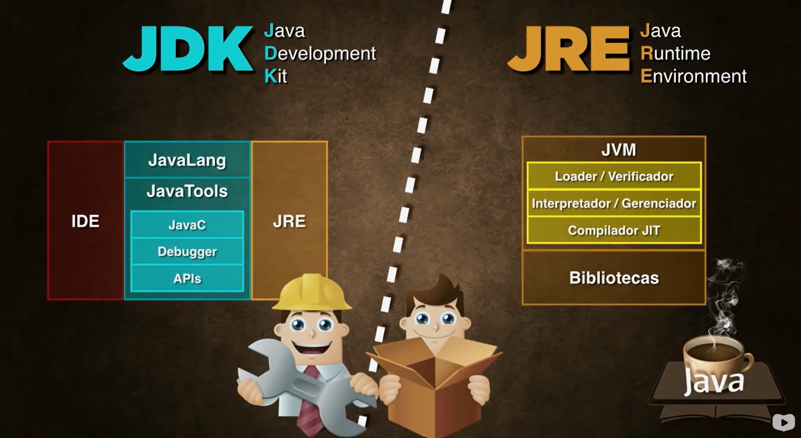 </br>

- Código compilado -> ocupa mais memória, mas leva menos tempo.
- Código interpretado -> ocupa menos memória, mas leva mais tempo.

> Processo de Compilação

- Compila -> é transformar de alto nível (código fonte) para máquina; pega esse código e passa para um compilador -> ele vai analisar o código, verificar erros.
- Código relocável -> código intermediário entre o compilador e o montador; traduzir todas as instruções de alto nível e transformar em baixo nível.
- Montador -> pega essas instruções e diz o que vai ficar na memória e transforma as instruções relocáveis em linguagem de máquina.
- Código objeto -> em limguagem de máquina 001010010.

> 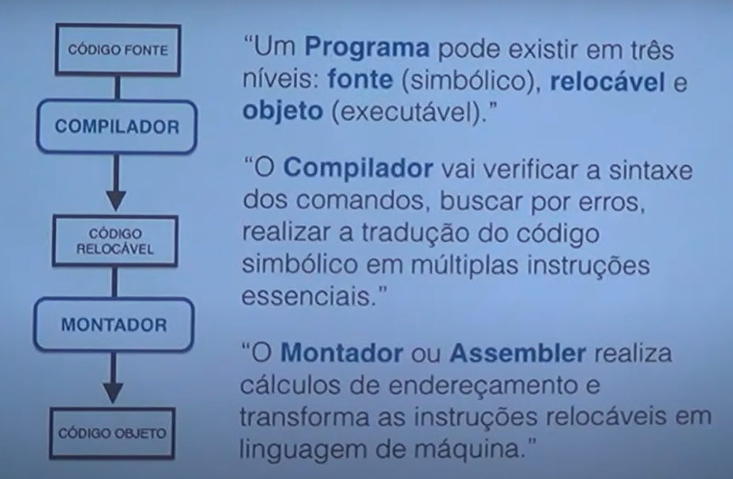 </br>

- SE -> para janelas; programas simples.
- EE -> para banco de dados; programas mais complexos.
- ME -> criar uma edição portátil do seu aplicativo.

## Introdução ao SWING

- permite que crie interfaces gráficas.

> 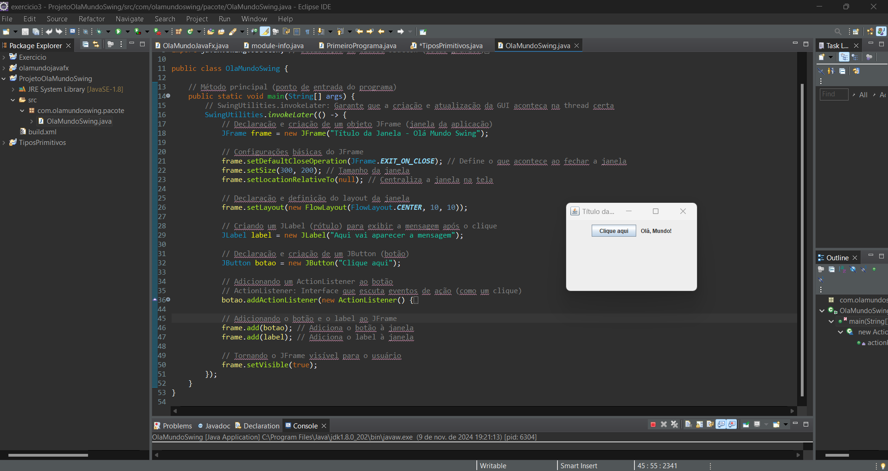 </br>

> 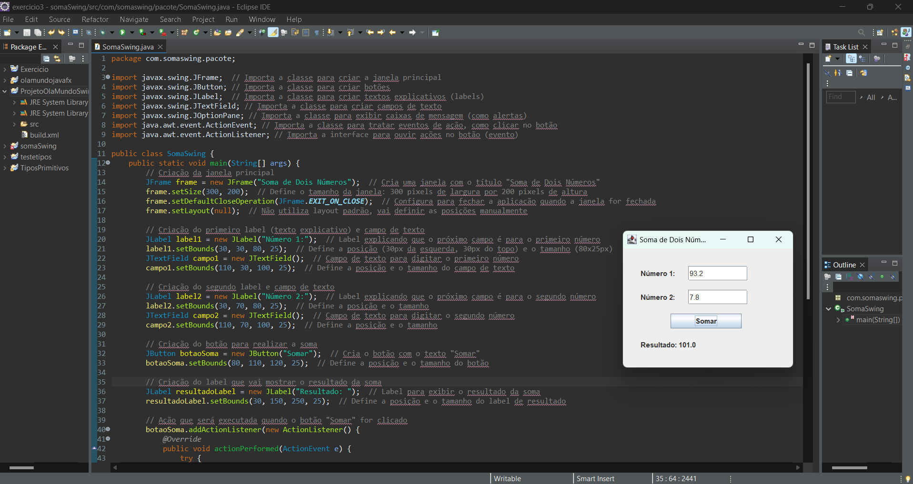 </br>

## Introdução ao JAVAFX

- É uma plataforma adicional de software, foi criado com objetivo de substituir o swing.
- Cria uma aplicação e serve para tudo (celulares, navegadores, videogames).

https://gluonhq.com/products/javafx/

> 

> 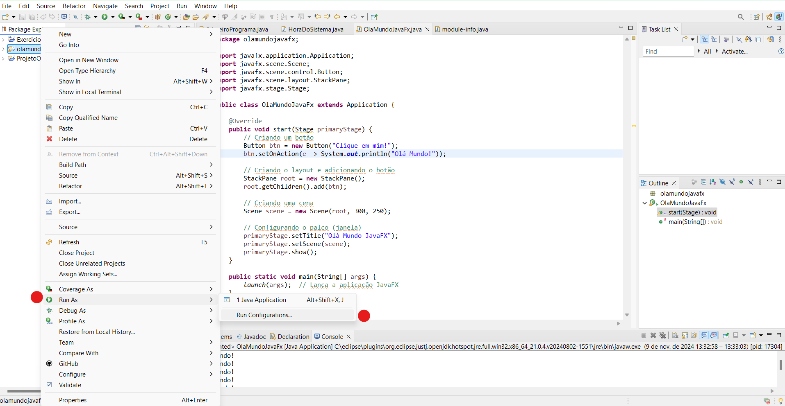

## Coloca o caminho que extraiu o arquivo

> 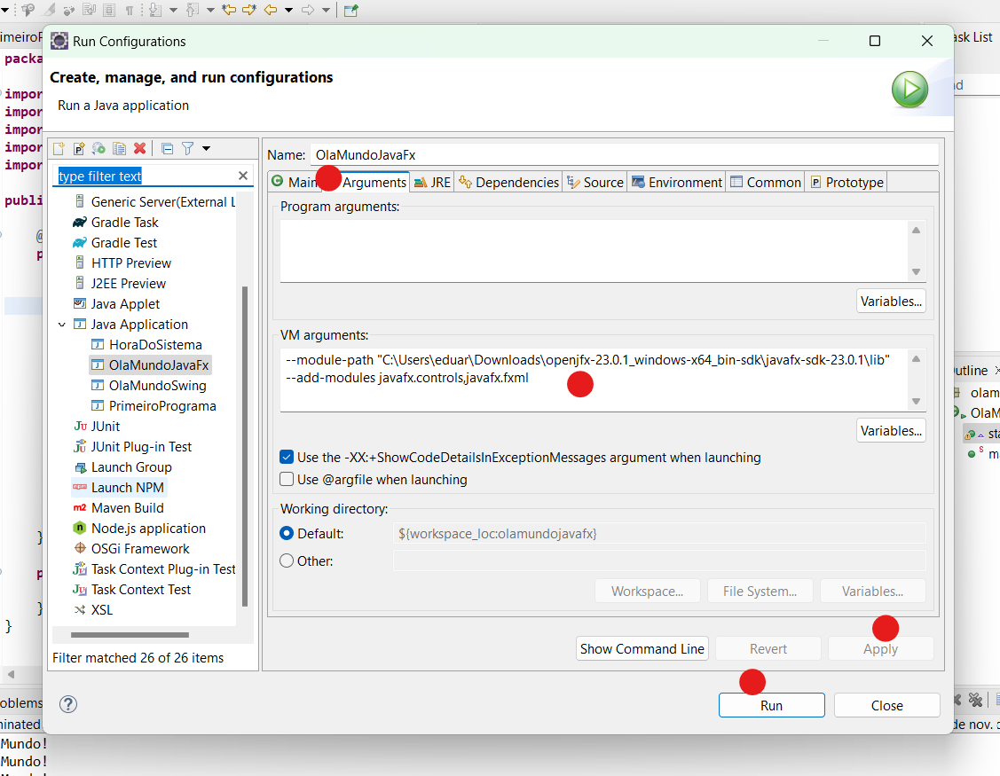

**module-info.java**

```xml
module olamundojavafx {
    requires javafx.controls;
    requires javafx.fxml;
    requires javafx.graphics;
    exports olamundojavafx;
}
```

**OlaMundoJavaFx.java**

```xml
package olamundojavafx; // Declaração do pacote, onde o arquivo está localizado

import javafx.application.Application; // Importa a classe Application, que é a base para a aplicação JavaFX
import javafx.scene.Scene; // Importa a classe Scene, usada para criar a "tela" da aplicação
import javafx.scene.control.Button; // Importa a classe Button, que cria botões interativos
import javafx.scene.layout.StackPane; // Importa a classe StackPane, que é um tipo de layout
import javafx.stage.Stage; // Importa a classe Stage, que representa a janela da aplicação

public class OlaMundoJavaFx extends Application { // Declaração da classe 'OlaMundoJavaFx', que herda de 'Application'

    @Override // Anotação que indica que o método a seguir sobrescreve (substitui) um método da classe pai
    public void start(Stage primaryStage) { // Método start: ponto de entrada da aplicação JavaFX. Método = ação que a classe pode realizar.

        // Declaração e criação de um botão com o texto "Clique em mim!"
        Button btn = new Button("Clique em mim!");

        // Evento: define a ação que ocorrerá quando o botão for clicado
        // A ação do evento é imprimir "Olá Mundo!" no console
        btn.setOnAction(e -> System.out.println("Olá Mundo!"));

        // Declaração de um layout do tipo StackPane (os elementos são empilhados um sobre o outro)
        StackPane root = new StackPane();

        // Adiciona o botão ao layout 'root', que é um StackPane
        root.getChildren().add(btn);

        // Declaração e criação de uma cena (Scene) que irá conter o layout e os componentes
        Scene scene = new Scene(root, 300, 250); // 300x250 são as dimensões da cena

        // Configuração do palco (janela): define o título da janela
        primaryStage.setTitle("Olá Mundo JavaFX");

        // Define a cena (que contém o layout e o botão) para ser exibida na janela
        primaryStage.setScene(scene);

        // Exibe a janela para o usuário (abre a janela)
        primaryStage.show();
    }

    public static void main(String[] args) { // Método main: ponto de entrada da aplicação Java
        // Lança a aplicação JavaFX, chamando o método start() que cria a interface
        launch(args); // Método launch é fornecido pela classe Application e inicia a execução da aplicação JavaFX
    }
}

```

## Salvar .jar

- Botão direito no projeto - export - Java - JAR file

> 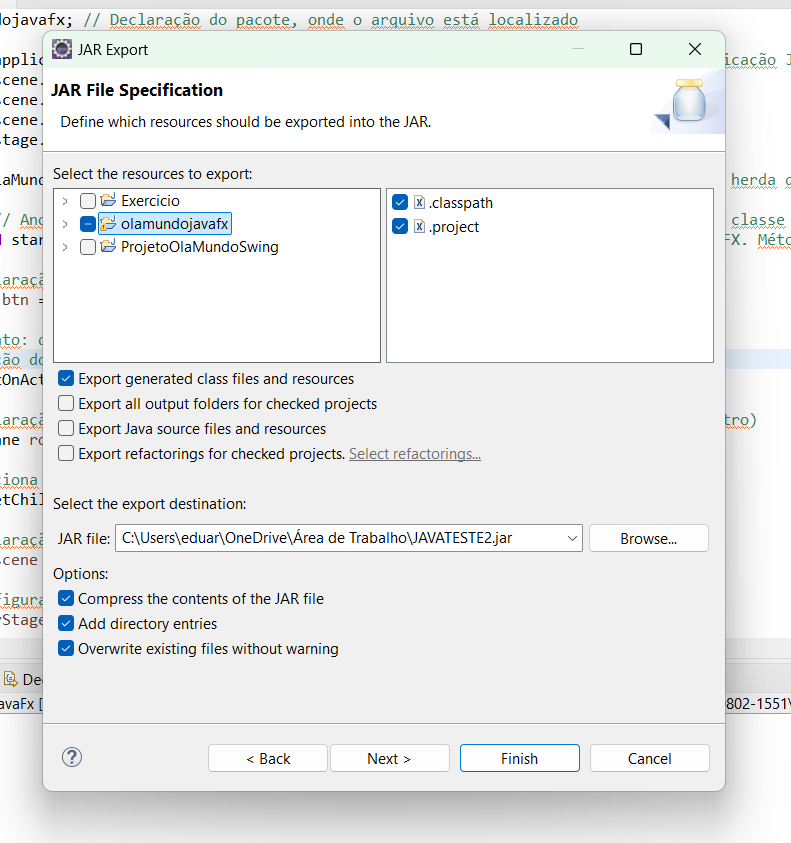

> 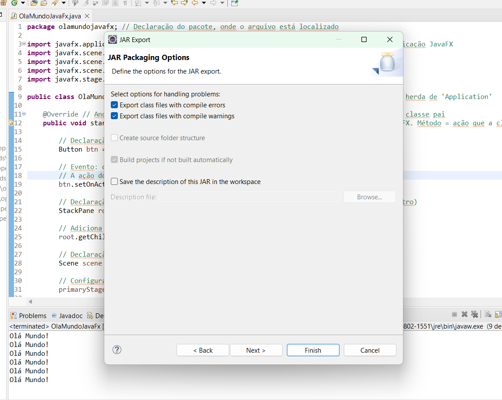

## Selecionar a classe principal, nesse exercício é apenas uma

> 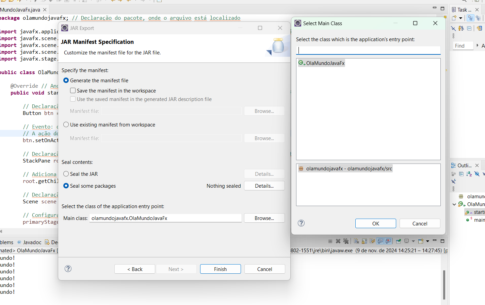 </br>

- **NEW** -> sempre que utilizar new, dentro de uma declaração, automaticamente esta criando um objeto, então tem que ter uma classe referenciando ele.

> Orientação a Objetos
> 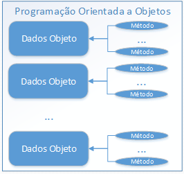 </br>

- Programação Orientada a Objetos (POO) é um paradigma de programação que se baseia na ideia de que tudo no código é um objeto. Um objeto é uma entidade que tem um estado e um comportamento. No Java, por exemplo, um objeto é uma instância de uma classe. Uma classe é como um modelo para um objeto, onde você pode definir seus atributos e métodos. Os atributos são as características do objeto e os métodos são as ações que o objeto pode executar.

```
// Definindo a classe Pessoa - essa classe representa um modelo para criar objetos do tipo Pessoa
class Pessoa {
    // Atributos da classe (ou características do objeto)
    // 'nome' e 'idade' representam os dados que cada pessoa terá
    String nome; // Armazena o nome da pessoa
    int idade;   // Armazena a idade da pessoa

    // Construtor da classe Pessoa
    // O construtor é um método especial que é chamado quando criamos um novo objeto
    // Aqui, ele recebe o nome e a idade e usa o 'this' para se referir aos atributos da classe
    Pessoa(String nome, int idade) {
        this.nome = nome; // 'this.nome' se refere ao atributo da classe, e 'nome' ao parâmetro do construtor
        this.idade = idade; // 'this.idade' se refere ao atributo, enquanto 'idade' é o parâmetro
    }

    // Método apresentar - representa uma ação ou comportamento do objeto
    // Esse método não recebe parâmetros e exibe uma mensagem no console com o nome e a idade da pessoa
    void apresentar() {
        System.out.println("Olá, meu nome é " + nome + " e eu tenho " + idade + " anos.");
        // O comando acima imprime o nome e a idade da pessoa no console
    }
}

// Classe principal que contém o método main, onde o programa inicia sua execução
public class Main {
    public static void main(String[] args) {
        // Criando um objeto da classe Pessoa e passando os valores "João" e 25 para o construtor
        // Isso inicializa os atributos 'nome' e 'idade' do objeto pessoa1
        Pessoa pessoa1 = new Pessoa("João", 25);

        // Chamando o método apresentar do objeto pessoa1
        // Isso vai exibir a mensagem "Olá, meu nome é João e eu tenho 25 anos."
        pessoa1.apresentar();
    }
}

```

> Método main -> No Java, o método main é o ponto de partida de qualquer programa. Quando você executa uma aplicação, é o main que começa a execução. Você pode ter muitas classes em um projeto, mas o Java vai procurar por esse método específico para saber por onde começar.

> Características principais do main:

- É estático: Isso significa que você não precisa criar um objeto da classe para chamar o método main.
- Ele é executado diretamente pela máquina virtual Java (JVM).
- É público: O método precisa ser público para que a JVM consiga acessá-lo e iniciar o programa.
- Sem valor de retorno: O método main não retorna nada, por isso ele é declarado como void (quer dizer vazio).
- Recebe um argumento: O main recebe um parâmetro chamado args, que é um array de String. Esse array pode ser usado para passar informações para o programa quando ele for iniciado pela linha de comando.
- **main** é onde o programa começa, e o args pode ser usado para passar informações extras ao programa.

```
public class MeuPrograma {
    public static void main(String[] args) {
        System.out.println("Primeiro argumento: " + args[0]);
        System.out.println("Segundo argumento: " + args[1]);
    }
}

SAÍDA:
Primeiro argumento: arg1
Segundo argumento: arg2

```

> Getters e Setters

- Os getters e setters no Java são métodos usados para acessar e modificar os valores dos atributos de uma classe. Eles ajudam a proteger e controlar o acesso aos dados de um objeto, permitindo seguir o princípio de encapsulamento.
- Imagine que você tem uma classe Pessoa com um atributo idade. Em vez de permitir que qualquer código altere a idade diretamente (o que pode causar problemas, por exemplo, se alguém tentar definir uma idade negativa), você usa um getter e um setter. Assim, você controla o acesso e pode garantir que a idade sempre tenha um valor válido.

```
public class Pessoa {
    private int idade; // Atributo privado

    // Getter para acessar a idade
    public int getIdade() {
        return idade;
    }

    // Setter para modificar a idade
    public void setIdade(int idade) {
        if (idade >= 0) { // Verifica se a idade é válida
            this.idade = idade;
        }
    }
}
```

- Getter (getIdade): É um método que retorna o valor do atributo idade. Ele permite que outras classes leiam a idade, mas sem poder modificar diretamente.
- Setter (setIdade): É um método que define o valor do atributo idade. Ele verifica se o valor é válido antes de atualizar o atributo, evitando problemas.

> Tipos em Java: Primitivos e Não Primitivos

> Typecast e Wrapper Class
> 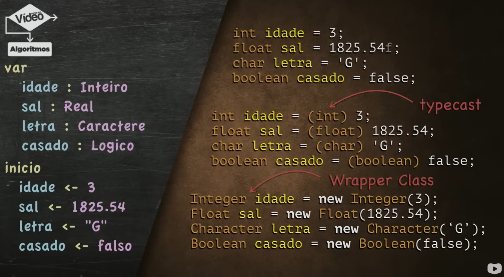 </br>

```
public class ExemploSimples {
    public static void main(String[] args) {
        // Typecast (conversão de tipo primitivo)
        int num = 10;
        double numDouble = num;  // Conversão implícita de int para double
        System.out.println("Número como double: " + numDouble);

        // Wrapper Class (Integer)
        Integer numWrapper = 20;  // Autoboxing: int é convertido automaticamente para Integer
        System.out.println("Número em Wrapper Class: " + numWrapper);

        // Unboxing: conversão de Integer para int
        int numPrimitivo = numWrapper;  // Unboxing: Integer é convertido automaticamente para int
        System.out.println("Número após Unboxing: " + numPrimitivo);
    }
}

```

## Explicação:

- Typecast: A variável num é convertida automaticamente de int para double.
- Wrapper Class: O valor 20 é atribuído à variável numWrapper do tipo Integer (usando autoboxing), e depois o valor é convertido de volta para um tipo primitivo int com o unboxing.

> Tipos Primitivos ->
> 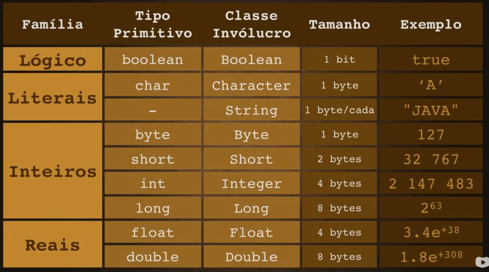 </br>

- São simples e básicos, usados para armazenar valores simples, como números inteiros e caracteres.
- int: Representa números inteiros. Por exemplo, int idade = 25; armazena a idade 25.
- char: Armazena caracteres, como letras ou símbolos. Por exemplo, char letra = 'A'; guarda a letra 'A'.
- boolean: Armazena valores verdadeiros ou falsos. Por exemplo, boolean estaChovendo = true; indica se está chovendo ou não.

> Tipos Não Primitivos

- Podem conter informações mais complexas e até mesmo outros tipos primitivos.
- String: Representa texto. Por exemplo, String nome = "Alice"; guarda o nome "Alice".
- Array: Armazena uma coleção de valores do mesmo tipo. Por exemplo, int[] numeros = {1, 2, 3, 4, 5}; guarda uma lista de números inteiros.
- Classe: Você pode criar suas próprias classes para representar objetos personalizados, como class Pessoa { String nome; int idade; }. Isso permite que você crie objetos como Pessoa alice = new Pessoa(); com propriedades nome e idade.
- ArrayList: É uma coleção dinâmica que pode crescer ou encolher. Por exemplo, ArrayList nomes = new ArrayList<>(); pode armazenar uma lista flexível de nomes.
- Objetos: Além das classes personalizadas, Java possui muitas classes pré-definidas que podem ser usadas para criar objetos, como Date para datas e Scanner para entrada de usuário.

> Operadores Unários => Incremento e Decremento

- O ++ quando vem depois do numero significa utiliza o numero 5 + 5 e depois de fazer essa soma, soma mais um no numero.

```
    int numero = 5;
	int valor = 5 + numero++;
	System.out.println(valor); SAÍDA 1 = 10
	System.out.println(numero); SAÍDA 2 = 6
```

- ++numero significa que ele pega 5 e soma com numero ja pré incrementado de unidade.

```
	int numero = 5;
	int valor = 5 + ++numero;
	System.out.println(valor); SAÍDA 1 = 11
	System.out.println(numero); SAÍDA 2 = 6
```

- Tenho o 10, vou tirar 1 e depois vou ter 9.

```
    int numero = 10;
	int valor = 4 + numero--;
	System.out.println(valor); SAÍDA 1 = 14
	System.out.println(numero); SAÍDA 2 = 9
```

> 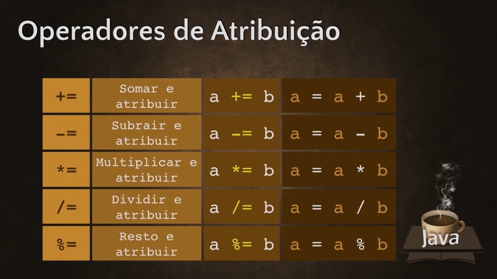 </br>

> Classe Math
> 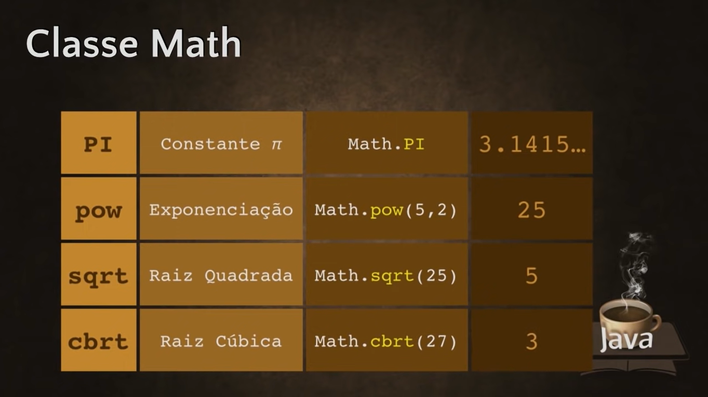 </br>
> 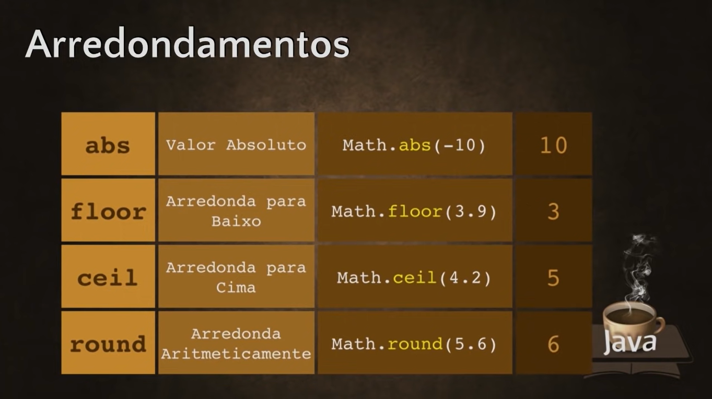 </br>

- Math.random -> gera um número entre 0.0 a 1.0.

```
    double ale = Math.random();
	System.out.println(ale);
```

- Se quiser gerar um número entre 5 e 10 => 5 + Math.random() \* (10 - 5). Outro exemplo entre 0 e 9, substitui 5 por 0 e 9 por 10.

```
    double ale = Math.random();
	int n = (int) (5 + ale * (10-5));
	System.out.println(n);
```

> Operadores Ternário

- Ele tem 3 componentes, o que vem antes da ?, o que vem depois da ? e o que vem depois dos ':'.
- O primeiro operador é uma expressão, ai coloca a ? e depois coloca qual valor vai ser atribuido caso essa expressão seja verdadeira x ':' e por ultimo coloca o valor que vai ser atribuido caso a expressão seja considerada falsa y.
- Tem que atribuir um valor para uma mesma variável.

```
		int n1, n2, r;
		n1 = 10;
		n2 = 8;
		r = (n1>n2)?n1:n2;
        (n1 é maior que n2 ? se sim mostra n1 se nao mostra n2)
		System.out.println(r); SAÍDA 10
```

- exemplo com fórmulas:

```
		int n1, n2, r;
		n1 = 10;
		n2 = 8;
		r = (n1>n2)?n1+n2:n1-n2;
		System.out.println(r); SAÍDA 18
```

> Operadores Relacionais
> 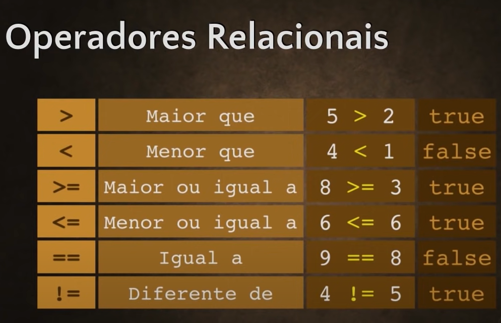

> Comparando strings

- Maneiras diferentes de declarar o mesmo objeto.

```
        String nome1 = "Gustavo";
		String nome2 = "Gustavo";
		String nome3 = new String("Gustavo");
		String res;
		res = (nome1==nome2)?"igual":"diferente";
		System.out.println(res); /*SAÍDA igual; nome1 e nome2 são 2 objetos que tem o mesmo conteúdo, tem a mesma estrutura*/
```

```
	public static void main(String[] args) {
		String nome1 = "Gustavo";
		String nome2 = "Gustavo";
		String nome3 = new String("Gustavo");
        /*Não tem variavel porque quando usa string com letra maiscula, string é uma classe então ela automaticamente vai criar um
		 objeto, a diferença de instanciar ou não utilizando a cláusula new vai fazer toda diferença.*/
		String res;
		res = (nome1==nome3)?"igual":"diferente";
		System.out.println(res); /*SAÍDA diferente; o ultimo objeto foi instanciado utilizando a clausula new, não tem tecnicamente
		a mesma estrutura dos 2 de cima;
		*/}
```

```
		String nome1 = "Gustavo";
		String nome2 = "Gustavo";
		String nome3 = new String("Gustavo");
		String res;
		res = (nome1.equals(nome3))?"igual":"diferente"; /*nome1 como é um objeto ele pode ter métodos, equals é um metodo que verifica
		 se o conteudo de um objeto é igual ao conteudo do outro*/
		System.out.println(res); /*SAÍDA igual;
		*/
```

- Para objetos em vez utilizar ==, utiliza equals, serve para qualquer classes envólucras.

> Operadores Lógicos
> 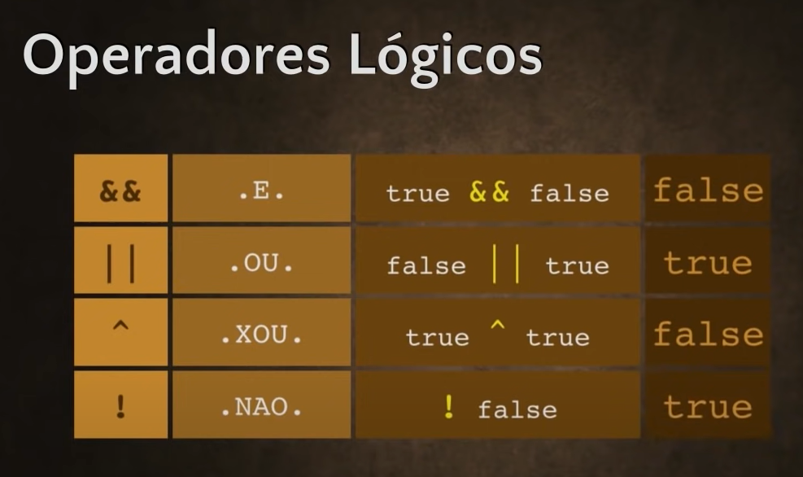
> 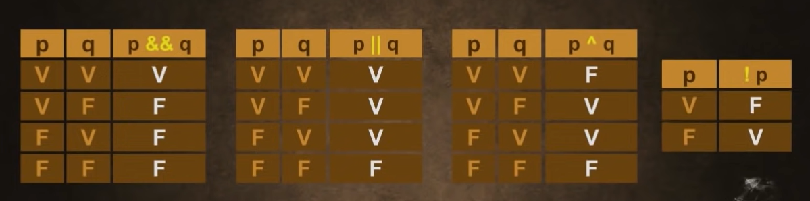

```
		 int x, y, z;
		 x = 4;
		 y = 7;
		 z = 12;
		 boolean r;
		 r = (x<y && y<z)?true:false;
		 System.out.println(r); \\SAÍDA true
```

> Sistema de votação
> 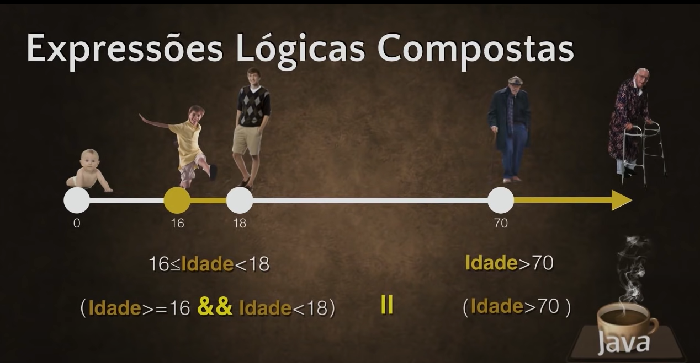

> 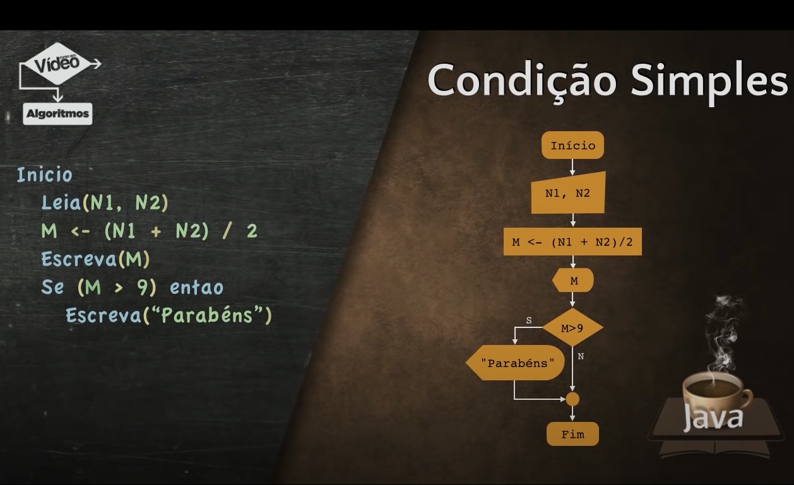
> 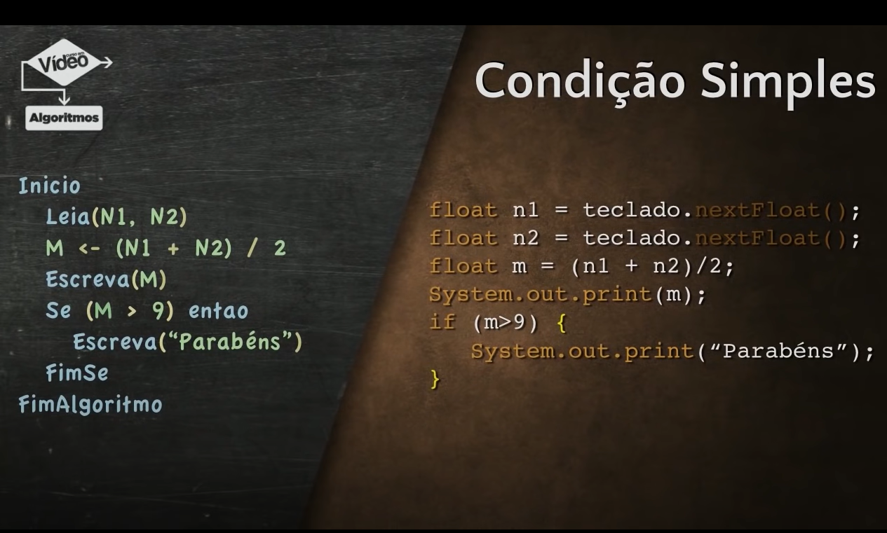

```
		Scanner teclado = new Scanner(System.in);
		System.out.print("Primeira nota: ");
		float n1 = teclado.nextFloat();
		System.out.print("Segunda nota: ");
		float n2 = teclado.nextFloat();
		float m = (n1+n2)/2;
		System.out.println("Sua média foi " + m );
		if (m>9) {
		System.out.println("Parabéns");}
```

> 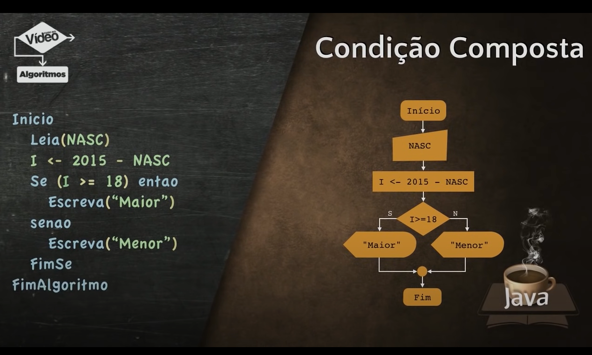
> 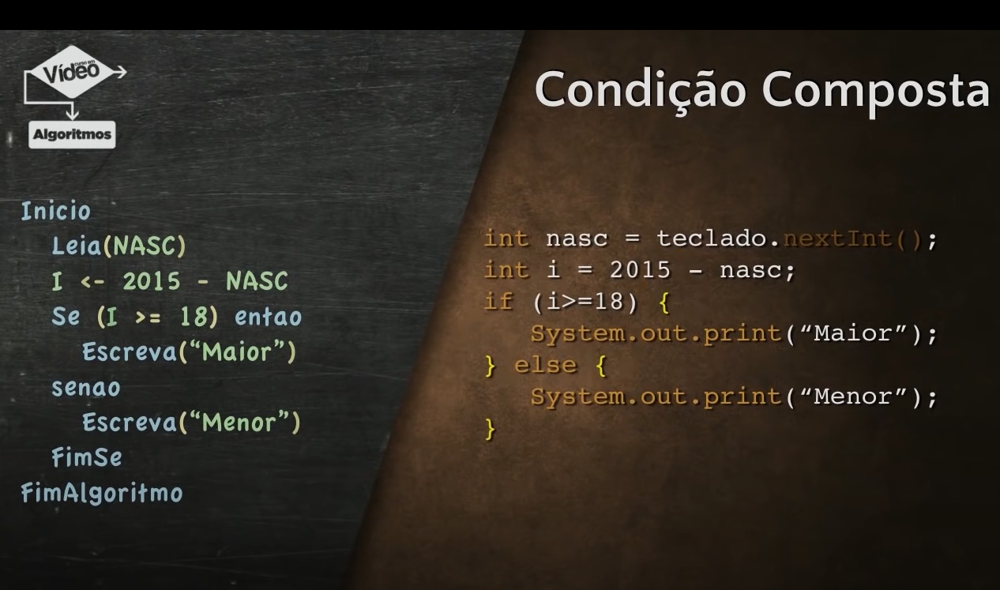

```
		Scanner t = new Scanner(System.in);
		System.out.println("Em que ano você nasceu ? ");
		int nasc = t.nextInt();
		int i = 2015 - nasc;
		System.out.println("Sua idade é " + i + " anos");
		if (i>=18) {
			System.out.println("Maior de idade");
		} else {
			System.out.println("Menor de idade");
		}
```

> 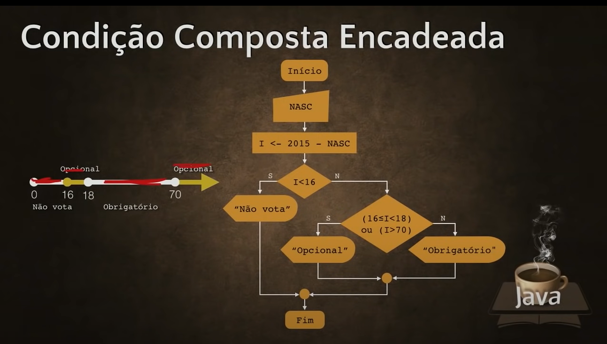
> 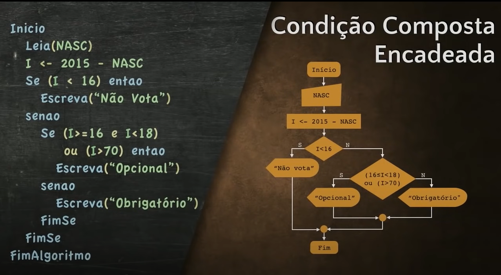
> 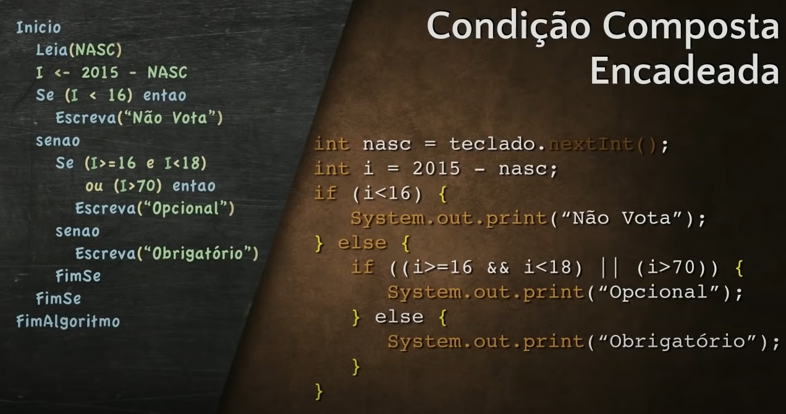
>  </br>

> A bolinha vai virar o comando break
> 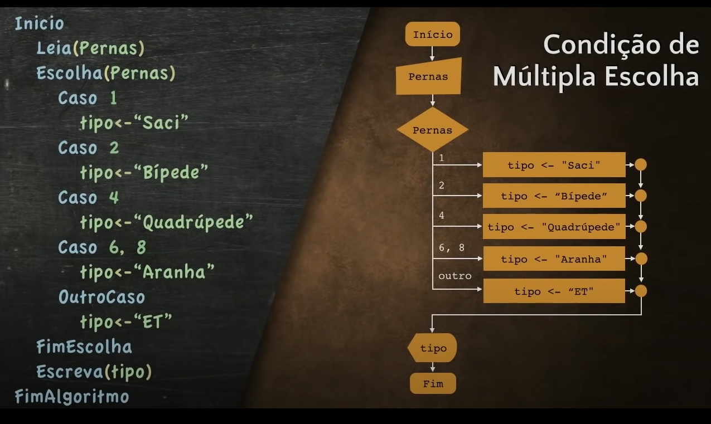

- default -> tipo padrão caso nenhum desses de cima seja escolhido pelo switch o tipo é "ET"; como é a ultima não precisa do break.
  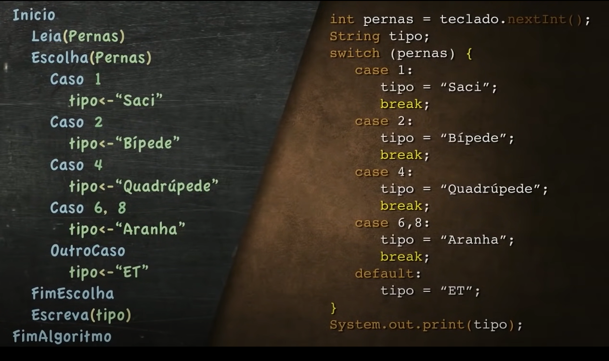

**(...) continua -> Curso de Java #11 - Estruturas de Repetição (Parte 1)**

## �� Tecnologias

<div>
  
  
 
          
</div>
